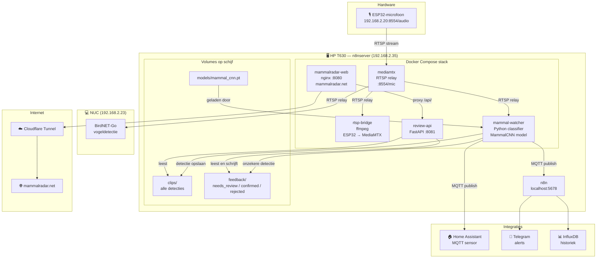
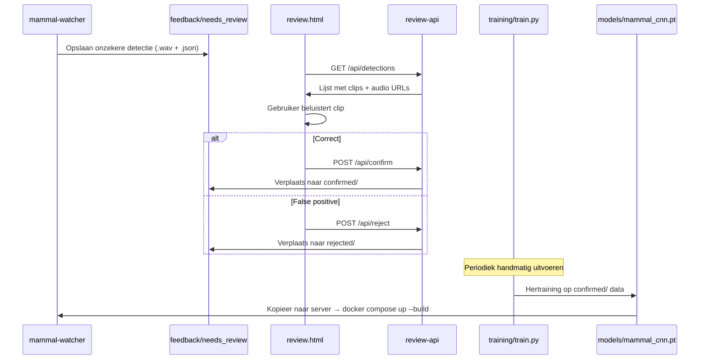
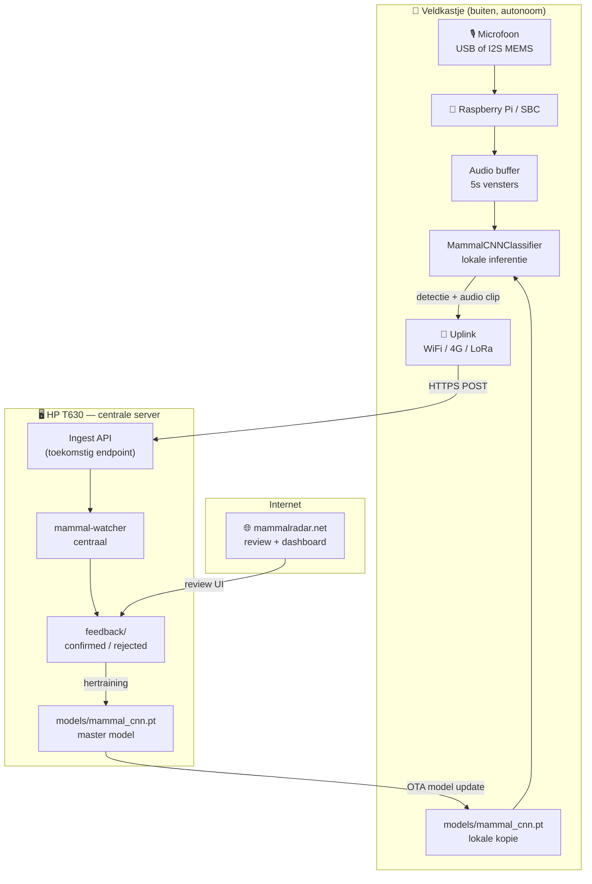
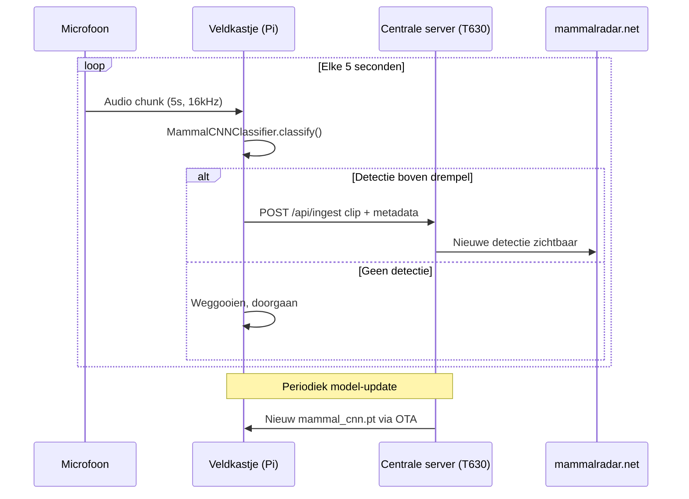
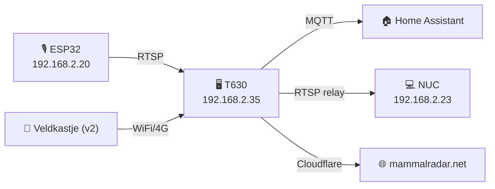

# 🗺️ MammalRadar — Architectuuroverzicht

Dit document geeft een volledig overzicht van alle componenten, datastromen en
integraties van het MammalRadar-systeem. Het wordt bijgehouden naast de code.

---

## Huidige opstelling (v1 — Centraal op HP T630)



---

## Feedback & hertraining loop



---

## Toekomstige opstelling (v2 — Veldkastje) 🌿

> **Status: in ontwerp** — Het veldkastje is een autonome, batterijaangedreven
> eenheid die lokaal classificeert en detecties via WiFi of 4G doorstuurt
> naar de centrale server.



### Veldkastje — hardwareopties (concept)

| Component | Optie A (WiFi-bereik) | Optie B (autonoom buiten bereik) |
|---|---|---|
| **SBC** | Raspberry Pi Zero 2W | Raspberry Pi 4 + 4G HAT |
| **Microfoon** | USB-microfoon of I2S MEMS | Zelfde |
| **Opslag** | microSD (lokale buffer) | microSD |
| **Connectiviteit** | WiFi naar thuisnetwerk | 4G SIM / LoRaWAN |
| **Stroom** | 5V adapter of powerbank | Zonnepaneel + LiPo accu |
| **Behuizing** | Weerbestendige IP65 box | Zelfde |
| **Model update** | Git pull + restart | OTA via HTTPS |

### Veldkastje — dataflow



---

## Componenten — snel overzicht

| Component | Type | Host | Poort | Doel |
|---|---|---|---|---|
| ESP32-microfoon | Hardware | 192.168.2.20 | 8554 | Audio bron |
| MediaMTX | Docker | T630 | 8554 | RTSP relay |
| rtsp-bridge | Docker | T630 | — | ESP32 → relay doorsturen |
| mammal-watcher | Docker | T630 | — | AI classificatie + MQTT |
| review-api | Docker | T630 | 8081 | Feedback REST API |
| mammalradar-web | Docker | T630 | 8080 | Website + review UI |
| n8n | Systeem | T630 | 5678 | Workflow automatisering |
| BirdNET-Go | Systeem | NUC (192.168.2.23) | 8080 | Vogeldetectie |
| Home Assistant | Systeem | HA server | 8123 | Domotica integratie |
| Mosquitto MQTT | Systeem | HA server | 1883 | Berichtenbus |
| Cloudflare Tunnel | Cloud | — | — | mammalradar.net → T630 |
| Veldkastje (v2) | Hardware | Buiten | — | Lokale detectie |

---

## Mappenstructuur op de server

```
/home/natuurwaarnemer/mammal-watcher/
├── config.yaml              # Configuratie (model, MQTT, drempels)
├── docker-compose.yml       # Stack definitie
├── Dockerfile               # mammal-watcher image
├── Dockerfile.api           # review-api image
├── mammal_watcher.py        # Hoofdproces + RTSP loop
├── classifier.py            # AI model klassen (Stub / YAMNet / MammalCNN)
├── review_api.py            # Feedback REST API (FastAPI)
├── feedback_collector.py    # Feedback opslag helper
├── models/
│   └── mammal_cnn.pt        # Getraind CNN model (~333 KB)
├── clips/
│   ├── confirmed/           # Bevestigde detecties (WAV)
│   ├── uncertain/           # Onzekere detecties (WAV)
│   └── index.jsonl          # Index van alle clips
├── feedback/
│   ├── needs_review/        # Wacht op beoordeling via UI
│   ├── confirmed/           # Goedgekeurd via review.html
│   └── rejected/            # Afgekeurd als false positive
├── training/
│   └── train.py             # CNN trainingsscript (PyTorch)
├── dataset/                 # Trainingsdata (GBIF, iNaturalist, NatureLM)
└── web/
    ├── index.html           # Landingspagina (mammalradar.net)
    ├── review.html          # Review interface (bevestigen / afwijzen)
    ├── nginx.conf           # Nginx configuratie + /api/ proxy
    └── assets/              # Logo en statische bestanden
```

---

## Netwerkoverzicht thuis



---

*Laatst bijgewerkt: 2026-05-14 — gegenereerd op basis van de actieve codebase.*
*Voor vragen of aanpassingen: open een Issue op GitHub.*
